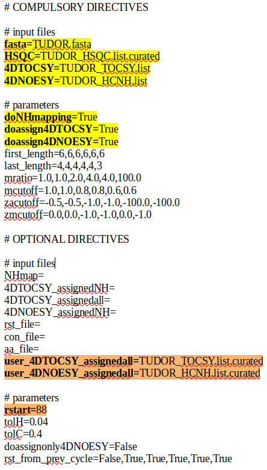

Brief Description
=================

4D-CHAINS is a software for fully automated protein backbone N-H and sidechain aliphatic C & H chemical shift assignment 
from 2 NMR spectra: the 4D HCNH TOCSY and the 4D HCNH NOESY. Read our paper in 
[Nature Communications](https://www.nature.com/articles/s41467-017-02592-z) for more details.

<table style="border-collapse: collapse">
<tr>
<td style="vertical-align: top" valign="top">
    <strong>Abstract from the paper</strong>
    
Automated methods for NMR structure determination of proteins are continuously becoming more robust. However, current methods 
    addressing larger, more complex targets rely on analyzing 6–10 complementary spectra, suggesting the need for alternative 
    approaches. Here, we describe 4D-CHAINS/autoNOE-Rosetta, a complete pipeline for NOE-driven structure determination of medium- 
    to larger-sized proteins. The 4D-CHAINS algorithm analyzes two 4D spectra recorded using a single, fully protonated protein 
    sample in an iterative ansatz where common NOEs between different spin systems supplement conventional through-bond 
    connectivities to establish assignments of sidechain and backbone resonances at high levels of completeness and with a minimum 
    error rate. The 4D-CHAINS assignments are then used to guide automated assignment of long-range NOEs and structure refinement 
    in autoNOE-Rosetta. Our results on four targets ranging in size from 15.5 to 27.3 kDa illustrate that the structures of proteins 
    can be determined accurately and in an unsupervised manner in a matter of days.
    

    <strong>Link to the paper</strong> 
    <a href="https://www.nature.com/articles/s41467-017-02592-z">Nat. Commun</a>
    

</td><td width="300">
</img>
</td>
</tr>
</table>

License
============

4D-CHAINS software for protein NMR assignment is a property of Masaryk university and the authors are 
**Thomas Evangelidis** and **Konstantinos Tripsianes**. The code is licensed under the 
Attribution-NonCommercial-NoDerivatives 4.0 International (CC BY- NC-ND 4.0). You are free to:

* Share - copy and redistribute the material in any medium or format.
* The licensor cannot revoke these freedoms as long as you follow the license terms.

Under the following terms:

* Attribution - You must give appropriate credit, provide a link to the license, and indicate if changes were made. 
  You may do so in any reasonable manner, but not in any way that suggests the licensor endorses you or your use.
* NonCommercial - You may not use the material for commercial purposes.
* NoDerivatives - If you remix, transform, or build upon the material, you may not distribute the modified material.
* No additional restrictions - You may not apply legal terms or technological measures that legally restrict others 
  from doing anything the license permits.
To view a full copy of this license, visit [this page](https://creativecommons.org/licenses/by-nc-nd/4.0/legalcode).

Installation
============

## Requirements:

* For large proteins (>180 residues) it is recommended to have >=32 GB RAM and >=64 GB SWAP memory.
* Pyhon3.x: I recommend installing Anaconda Python Distribution from https://docs.continuum.io/anaconda/install 
  that is platform independent.

Download the code (clone the repositoty) from github:

    git clone https://github.com/tevang/4D-CHAINS.git

Or to update an existing repository:
	
    git checkout master
    git pull origin master

Create a dedicated Python environment:

    conda env create -f 4dchains.yml 

Activate the Python environment whenever you wish to run 4D-CHAINS:

    conda activate 4dchains
    conda deactivate # to exit the environment when you finish

Add 4D-CHAINS to your PATH and PYTHONPATH environment variables to call 4D-CHAINS executables from every 
directory. E.g. place the following lines in your .bashrc:
	
    export PATH=<path to 4D-CHAINS/>/bin:$PATH
    export PYTHONPATH=<path to 4D-CHAINS/>:$PYTHONPATH

To run 4D-CHAINS use the 4Dchains.py script. You can do all operations you wish with this script as long as 
you provide the appropriate protocol file. E.g.
	
    4Dchains.py -p protocol.txt

You can generate a template protocol file like this:
	
    4Dchains.py -writeprotocol

For information about all the available directives in the protocol file, please refer to the Documentation.

Tutorials
============

You can find tutorials for TUDOR (60 residues) and nEIt (248 residues) proteins under the `tutorials/` directory. 
In each folder you will find a protocol file and all the required input files. 
Below are the contents of the protocol file: 

The directives you must modify are highlighted in yellow, while the optional directives in orange. 
The rest are just for advanced users, and it is recommended to leave them unaltered. For a detailed description 
of each directive, please refer to the Documentation.

-----

**fasta:** the FASTA sequence file of the protein construct.

**HSQC:** the H-N HSQC spectrum as a 3-column (spin system's label, N, HN) Sparky list file.

**4DTOCSY:** the 4D HCNH TOCSY as a 5-column (spin system's label, H, C, N, HN) Sparky list file.

**4DNOESY:** the 4D HCNH NOESY as a 6-column (spin system's label, H, C, N, HN, peak's intensity) Sparky list file.

**doNHmapping:** whether to do NH-mapping (1st step)

**doassign4DTOCSY:** whether to do chemical shift assignment in the TOCSY (2nd step)

**doassign4DNOESY:** whether to do chemical shift assignment of the remaining unassigned peaks in the NOESY (3rd step)

**user_4DTOCSY_assignedall:** same as **4DTOCSY** but with manually assigned peak labels. If this file is provided 
then its labels will be used to proof-read the assigned TOCSY peaks in the output file.

**user_4DNOESY_assignedall:** same as **4DNOESY** but with manually assigned peak labels. If this file is provided 
then its labels will be used to proof-read the assigned NOESY peaks in the output file.

**rstart:** the residue ID of the first amino acid in the FASTA sequence you have provided. If your HSQC file has 
labels, and **rstart** is left blank, then the first residue ID will be guessed from the labels. If your HSQC file 
does not have labels, then the spin systems will be indexed by their order of occurrence, e.g. 'X1', 'X2', 'X3', and so on. 

-----

In the same folder are included `*.curated` Sparky list files, which contain the manually assigned labels of 
the spin systems. If your input HSQC file doesn't contain any labels (e.g. `HSQC=TUDOR_HSQC.list`), 
then 4D-CHAINS will index the spin systems by the order they occur in that file. If you set 
`HSQC=TUDOR_HSQC.list.curated` then the labels you have set will be passed to the TOCSY and NOESY files 
during chemical shift assignment. If, in addition, you provide curated TOCSY and NOESY files, to directives
`user_4DTOCSY_assignedall` and `user_4DNOESY_assignedall`, respectively, then the final .xeasy file will contain
comments like <CORRECT>, <WRONG>, which indicate at which peak the automatic assignment has succeeded or has failed.

To run full chemical shift assignment of the TUDOR, do:

	4Dchains.py -p TUDOR_protocol.txt

Briefly, the N-H resonances are mapped to the protein sequence. These N-H 
resonances are used to assist the assignment of 4D-TOCSY peaks to aliphatic carbons. Finally, the assignments 
from 4D-TOCSY are transferred to the respective 4D-NOESY peaks, and the rest of them are assigned *de novo*.
At the end you will find several output files and a directory named `4DCHAINS_workdir`, which contains all the 
intermediate files for error backtracking. The most important file is **4DNOESY_assignedall.proofread.xeasy**,
which will be passed as the input *chemical shift file* to autNOE-Rosetta for pro-
tein structure prediction, as described below.

To see what these output files mean, do:

    4Dchains.py -h

The assignment of nEIt protein's peaks by 4D-CHAINS requires >=32 GB RAM  and >= 64 GB SWAP due to its large size. 
To launch it, do:

	4Dchains.py -p nEIt_protocol.txt

Documentation
=============

For detailed description of all directives and executables refer to file `doc/4D-CHAINS_Manual.pdf`.

